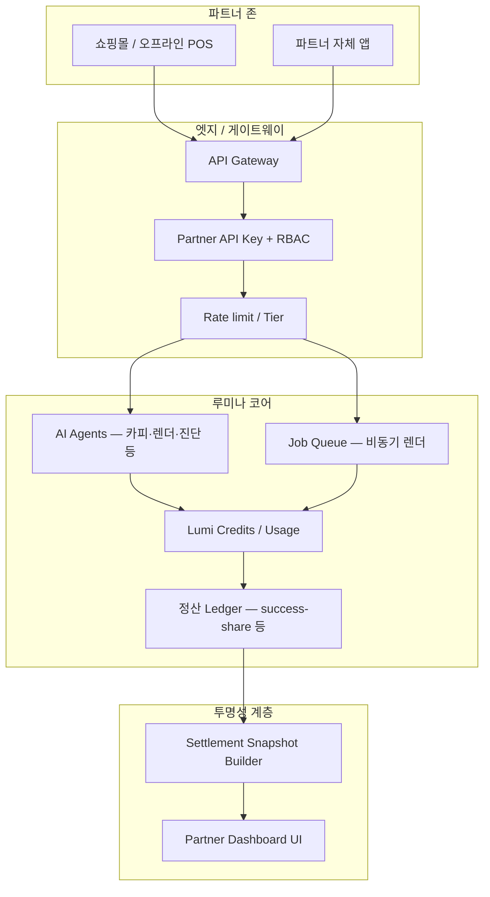

# 루미나플랫폼 제2호 브랜딩 — 기술 기획서 (V2)

| 항목 | 내용 |
|------|------|
| 문서 ID | `LUMINA_PLAN_V2` |
| 버전 | 0.1 |
| 상태 | Draft — 구현과 동기화 |
| 관련 철학 | 「나눔을 통한 만물의 번영」, 헤리티지 온(穩)·준(準)·쾌(快) |
| 코드 앵커 | `lib/partners/sharing-integration-api.ts`, `lib/partners/settlement-transparency.ts`, `app/api/partners/settlement-transparency/route.ts` |
| AI 규칙 | `.cursor/rules/lumina-branding-ii-symbiosis.mdc`, 루트 `.cursorrules` |

---

## 1. 목적과 범위

본 문서는 제2호 브랜딩을 **마케팅 문구가 아닌 시스템 요구사항**으로 고정하기 위한 기술 기획이다.

- **포함:** 나눔 철학이 반영된 논리 아키텍처, 파트너 전용 나눔형 API 설계 방향, 투명 정산 대시보드 기획.
- **제외:** 최종 상업 약관, 정확한 요율·가격표(별도 정책·법무와 확정).

**의사결정 기준(전사):** *이것이 파트너에게 이로운 나눔인가?*  
**금지:** 근거 없는 실시간 수치·효능, 숨은 수수료 UX, 왜곡된 매출 집계.

---

## 2. 「나눔」 철학이 반영된 시스템 아키텍처

### 2.1 설계 원칙

| 원칙 | 기술적 함의 |
|------|-------------|
| **상생 (Win-Win)** | 파트너 티어·한도·온보딩을 “비용·마찰” 최소화 우선으로 설계. |
| **투명성** | 정산·수수료·크레딧은 **ledger / line item** 단위로 추적 가능하게 모델링. |
| **접근성 (기술 민주화)** | 동일한 능력을 **저비용 티어**에서도 검증 가능하게 API 게이트웨이로 노출. |
| **온·준·쾌** | 서비스 안정(온), 수치·정산 정확도(준), 응답·작업 처리 속도(쾌)를 SLA 관점에서 명시. |

### 2.2 논리 구조 (고수준)



### 2.3 데이터 흐름 (정산·투명성)

1. 파트너가 **기간 매출·귀속 매출**을 신고하거나, 연동 시스템이 집계한다.  
2. `computeRevenueShareSettlement` (`lib/partners/revenue-share.ts`)로 **성공보수** 후보를 산출한다.  
3. `buildSettlementTransparencySnapshot` (`lib/partners/settlement-transparency.ts`)가 **항목별 라인**(귀속 매출, 성공보수, 운영 재투자, 파트너 풀 등)으로 펼친다.  
4. 장기적으로 **Supabase 등 영속 ledger**와 동기화하고, 대시보드는 **읽기 전용 API**로 스냅샷을 제공한다.

### 2.4 저장소·배포 (방향)

| 구분 | 방향 |
|------|------|
| 시크릿 | API 키, 웹훅 HMAC 시크릿 — 환경 변수 / 비밀 관리자 |
| Ledger | `revenue_share_ledger` 등 (기존 코드 주석 TODO와 정합) |
| 감사 | 정산 스냅샷 생성 시점·버전·정책 비율 버전을 메타데이터로 보존 |

---

## 3. 파트너사 전용 나눔형 API 설계안

구현 초안 상수·타입: `lib/partners/sharing-integration-api.ts` (`LUMINA_SHARING_API_VERSION = "0.1-draft"`).

### 3.1 버전·베이스 URL

- **버전:** URI prefix `/v1` (OpenAPI 3.x로 문서화 예정).
- **베이스 URL 예:** `https://api.lumina.example/v1` (배포 도메인에 따라 확정).

### 3.2 인증·권한

| 항목 | 설계 |
|------|------|
| 인증 | `Authorization: Bearer <partner_api_key>` |
| 스코프 | 키별로 `agents:invoke`, `jobs:read`, `usage:read` 등 세분화 권장 |
| 멱등 | 쓰기 요청에 `Idempotency-Key` 헤더(중복 청구·중복 작업 방지) |

### 3.3 티어·한도 (초안)

`LUMINA_SHARING_TIER_DRAFT`와 동일한 의미:

| 티어 | 분당 요청(초안) | 월 포함 단위(초안) | 포지셔닝 |
|------|-----------------|---------------------|----------|
| `community` | 30 | 500 | 검증·소규모 — 핵심 에이전트 저비용 |
| `growth` | 120 | 5000 | 성장 브랜드 — 카피·렌더 묶음 |
| `scale` | 400 | 25000 | 다점포·고빈도 — SLA·전담 온보딩 |

실제 수치는 계약·비용 구조에 따라 조정; **파트너 대시보드에 한도·잔여량을 노출**한다.

### 3.4 엔드포인트 초안

| 메서드·경로 | 역할 |
|-------------|------|
| `GET /v1/health` | 게이트웨이·의존 서비스 가용성 |
| `GET /v1/capabilities` | 파트너 키에 허용된 에이전트·버전 목록 |
| `POST /v1/agents/{agentId}/invoke` | 단발 추론·카피 생성 등 (동기 또는 장시간 시 job 전환) |
| `GET /v1/jobs/{jobId}` | 비동기 작업 상태(렌더 큐 등과 연계) |
| `GET /v1/usage/summary` | 기간별 크레딧·호출 수 — **투명성** 핵심 |

### 3.5 웹훅 (선택)

`SharingWebhookDraft`: `callbackUrl`, `idempotencyKey`.  
콜백 페이로드는 **서명(HMAC)** 으로 위변조 방지.

### 3.6 기존 루미나 API와의 관계

- 현재 앱은 Next.js `app/api/*` 라우트로 기능별 제공 중이다.  
- 나눔형 공개 API는 **게이트웨이 뒤에서 동일 도메인 또는 별도 `api.` 서브도메인**으로 노출하고, 내부적으로 기존 핸들러를 호출하는 **파사드** 패턴을 권장한다.

---

## 4. 투명 정산 대시보드 기획

### 4.1 목표 UX

- 파트너가 **기간을 선택**하면 해당 기간의 **귀속 매출·성공보수·항목별 배분**을 한 화면에서 이해한다.  
- “수수료가 어디로 갔는지”를 **라인 아이템 + 짧은 설명**으로 제공한다.  
- 정책 문구(`sharingNarrativeKo`)는 **법무 검토된 고정 카피**로 교체 가능하게 한다.

### 4.2 화면 구성 (와이어 수준)

| 영역 | 내용 |
|------|------|
| **헤더** | 파트너 ID(마스킹 가능), 선택 기간, 마지막 갱신 시각(`generatedAt`) |
| **요약 카드** | 귀속 매출, 성공보수 합계, 적용 요율 |
| **배분 테이블** | `SettlementTransparencyLine` — 라벨, 금액, `explanationKo` |
| **나눔 서술** | 플랫폼 운영·파트너 풀 재투자 등 정책 요약 |
| **감사 링크** | Ledger ID가 있으면 “상세 원장은 별도 채널에서 확인” 등 안내(운영 정책에 따름) |

### 4.3 백엔드 연동 (현 구현)

| 항목 | 내용 |
|------|------|
| 스냅샷 빌더 | `buildSettlementTransparencySnapshot` |
| HTTP | `GET /api/partners/settlement-transparency` |
| 쿼리 | `partnerId`, `periodStart`, `periodEnd`, `grossRevenueWon` — 선택: `attributedRevenueWon`, `sharePercent` |

**예시 (개발):**

```http
GET /api/partners/settlement-transparency?partnerId=demo&periodStart=2026-04-01&periodEnd=2026-04-30&grossRevenueWon=10000000
```

응답 JSON: `ok`, `branding: "lumina_branding_ii"`, `snapshot` (라인·서술·ledgerId).

### 4.4 환경 변수 (배분 비율 초안)

| 변수 | 의미 | 기본(초안) |
|------|------|------------|
| `LUMINA_TRANSPARENCY_OPS_PERCENT_OF_FEE` | 성공보수 중 플랫폼 운영 배분 비율 | 60 |
| `LUMINA_TRANSPARENCY_REINVEST_PERCENT_OF_FEE` | 파트너 나눔·접근성 풀 배분 비율 | 40 |

합계 100%가 되도록 운영에서 관리한다.

### 4.5 보안·프라이버시

- 대시보드는 **파트너 세션 또는 API 키 + IP 제한** 등으로 보호.  
- 공개 랜딩에는 **집계 예시만** 노출하고, 실제 계약사 데이터는 노출하지 않는다.

---

## 5. 구현 로드맵 (권장 순서)

1. **완료(현재):** 투명 스냅샷 라이브러리, `GET` API 초안, Cursor 규칙 반영.  
2. **단기:** Partner 전용 라우트(예: `/partners/transparency`)에서 스냅샷 시각화, 인증 연동.  
3. **중기:** Ledger 영속화, OpenAPI 게시, 나눔형 `/v1` 게이트웨이와 내부 API 연결.  
4. **지속:** 정책·요율 변경 시 스냅샷 메타데이터에 **정책 버전** 기록.

---

## 6. 변경 이력

| 날짜 | 버전 | 내용 |
|------|------|------|
| 2026-04-07 | 0.1 | 최초 작성 — 아키텍처, 나눔형 API, 투명 정산 대시보드 기획 |

---

*본 문서는 제2호 브랜딩 지시에 따른 기술 번역이며, 상업·법적 조건은 별도 문서와 일치시켜야 한다.*
